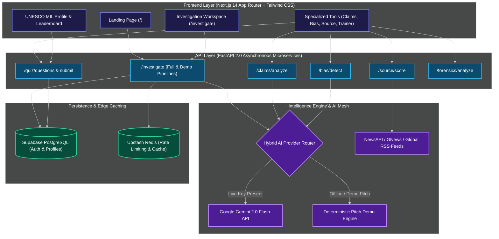
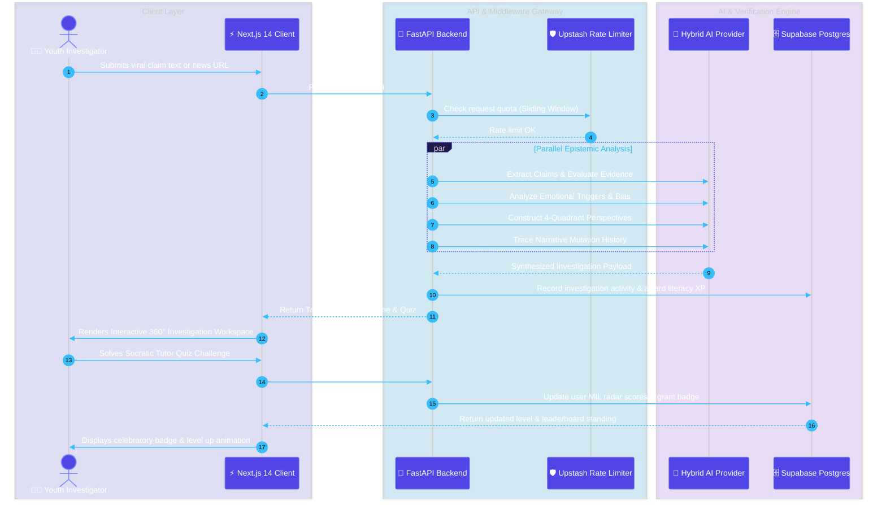
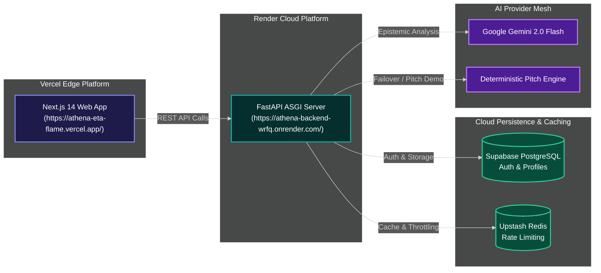

<div align="center">

  

# 🦉 ATHENA

### Autonomous Media Literacy Intelligence, 360° Claim Verification & Cognitive Defense Platform

**Designed & Engineered for the UNESCO Youth Hackathon 2026**  
_“Play Your Part: Youth Designing the Future of Media and Information Literacy”_

  <p align="center">
    <a href="https://athena-eta-flame.vercel.app/"></a>
    <a href="https://drive.google.com/file/d/1XVQtJ0OKH3B66EuOJ7oiXDxQFfyaR8Zc/view?usp=drive_link"></a>
    <a href="https://athena-backend-wrfq.onrender.com/"></a>
    <a href="https://athena-backend-wrfq.onrender.com/docs"></a>
    <a href="https://github.com/himanshu-jadhav108/Project-Athena"></a>
    <a href="LICENSE"></a>
  </p>

  <p align="center">
    <a href="https://drive.google.com/file/d/1XVQtJ0OKH3B66EuOJ7oiXDxQFfyaR8Zc/view?usp=drive_link" target="_blank"><b>🎥 Demo Video</b></a> •
    <a href="https://athena-eta-flame.vercel.app/" target="_blank"><b>🌐 Live Website</b></a> •
    <a href="#-key-project-links"><b>🔗 Quick Links</b></a> •
    <a href="#-key-feature-matrix"><b>🚀 Key Features</b></a> •
    <a href="#-system-architecture--workflow-diagrams"><b>📐 Architecture</b></a> •
    <a href="#-mathematical-trust--credibility-scoring-model"><b>📊 Scoring Model</b></a> •
    <a href="#-api-endpoint-documentation"><b>⚡ API Docs</b></a> •
    <a href="#-quick-start--local-development"><b>🛠️ Quick Start</b></a>
  </p>

> _"Don't just know what to believe. Learn how to evaluate."_  
> **ATHENA** transforms passive digital consumers into empowered critical investigators through transparent epistemic reasoning, 4-quadrant perspective exploration, temporal narrative memory, and gamified UNESCO MIL skill progression.

</div>

---

## 🎥 Platform Demonstration

<div align="center">
  <a href="https://drive.google.com/file/d/1XVQtJ0OKH3B66EuOJ7oiXDxQFfyaR8Zc/view?usp=drive_link" target="_blank">
    
  </a>
  <p style="margin-top: 12px;">
    🎬 <i>Click above or <b><a href="https://drive.google.com/file/d/1XVQtJ0OKH3B66EuOJ7oiXDxQFfyaR8Zc/view?usp=drive_link" target="_blank">Open on Google Drive ↗</a></b> to watch the complete 360° investigation walkthrough and pitch demo.</i>
  </p>
  <p><i>Figure 1: ATHENA Live Workspace — Multi-Dimensional Trust Passport, Perspective Explorer, Narrative Memory, and UNESCO MIL Trainer.</i></p>
</div>

---

## 🌐 Key Project Links

| Artifact                        | Access Link / Status                                                                                                     | Description                                                       |
| :------------------------------ | :----------------------------------------------------------------------------------------------------------------------- | :---------------------------------------------------------------- |
| 🌐 **Live Web Application**     | [https://athena-eta-flame.vercel.app/](https://athena-eta-flame.vercel.app/)                                             | Production Next.js 14 Client deployed on Vercel Edge Network      |
| 🎥 **Demo Video**               | [Watch Demo Video (Google Drive)](https://drive.google.com/file/d/1XVQtJ0OKH3B66EuOJ7oiXDxQFfyaR8Zc/view?usp=drive_link) | End-to-end walkthrough of 360° investigation workspace & AI tutor |
| ⚡ **Backend REST API**         | [https://athena-backend-wrfq.onrender.com/](https://athena-backend-wrfq.onrender.com/)                                   | FastAPI Asynchronous Engine hosted on Render Cloud                |
| 📜 **Interactive Swagger Docs** | [https://athena-backend-wrfq.onrender.com/docs](https://athena-backend-wrfq.onrender.com/docs)                           | OpenAPI 3.0 Interactive API Explorer & Schema Specs               |
| 📚 **ReDoc API Specifications** | [https://athena-backend-wrfq.onrender.com/redoc](https://athena-backend-wrfq.onrender.com/redoc)                         | Human-readable REST API documentation                             |
| 🏛️ **Supabase Cloud Schema**    | [`Backend/supabase_schema.sql`](Backend/supabase_schema.sql)                                                             | Relational SQL schema for profiles, quizzes, and leaderboard      |

---

## 📈 Visual Project Metrics

<div align="center">

|            Metric            |                     Benchmark                     | Description                                                                  |
| :--------------------------: | :-----------------------------------------------: | :--------------------------------------------------------------------------- |
| 🛡️ **5 UNESCO MIL Pillars**  | **Source, Context, Evidence, Framing, Forensics** | Comprehensive Media & Information Literacy skill tracking framework          |
| 🧭 **4 Perspective Sectors** | **Scientific, Fact-Check, Mainstream, Community** | Multi-stakeholder viewpoint mapping for balanced discourse analysis          |
|     🧪 **13 / 13 Tests**     |           **100% Pytest Passing Rate**            | Full test coverage across analysis, bias, scoring, and investigation modules |
| ⚡ **Hybrid AI Resilience**  | **Google Gemini 2.0 + Deterministic Demo Engine** | 100% pitch reliability with zero offline failure modes                       |
| 🔍 **Explainability Policy** |   **Epistemic Rationale & Evidence Footnotes**    | Zero black-box binary verdicts; calibrated uncertainty & confidence metrics  |
| 🎮 **Gamified Progression**  |   **Badges, XP, Quizzes & Global Leaderboard**    | Active experiential learning designed for digital-native youth               |

</div>

---

## ⚔️ Why ATHENA? (Paradigm Shift)

| Dimension / Problem         |   Traditional Fact-Checkers   |        Generic Generative AI        |                    ATHENA Epistemic Platform                    |
| :-------------------------- | :---------------------------: | :---------------------------------: | :-------------------------------------------------------------: |
| **Output Verdict**          | Binary "TRUE / FALSE" stamps  | Hallucination-prone text generation |     **Multi-dimensional Trust Passport & Evidence Matrix**      |
| **Pedagogical Goal**        | Tells users _what_ to believe |      Passive answer retrieval       |         **Teaches users _how_ to critically evaluate**          |
| **Transparency & Evidence** |  Opaque editorial guidelines  |     Black-box hidden reasoning      |    **Epistemic breakdown with confidence & missing context**    |
| **Perspective Diversity**   | Monolithic institutional view |   Single-prompt biased consensus    |  **4-Quadrant comparative matrix across diverse stakeholders**  |
| **Temporal Context**        |    Static snapshot in time    |         No mutation history         |   **Narrative Memory tracing claim origin, spread & debunk**    |
| **Youth Engagement**        |       Dry text articles       |             Text walls              | **Gamified UNESCO MIL skill radar, badges & interactive tutor** |

---

## 🌟 Executive Overview

In the modern digital landscape, viral misinformation, emotionally manipulative headlines, and out-of-context audio/visual media spread faster than truth. Young digital citizens frequently amplify unverified claims not out of negligence, but because they lack accessible, engaging tools to exercise **Media and Information Literacy (MIL)** in real time.

**ATHENA** is an enterprise-grade, open-source AI platform engineered specifically for the **UNESCO Youth Hackathon 2026**.

Rather than acting as an authoritarian oracle that renders opaque binary verdicts, ATHENA operates as an **epistemic inquiry accelerator**. When an investigation is triggered, ATHENA simultaneously extracts central assertions, evaluates source integrity, detects emotional manipulation triggers, cross-references four distinct perspective quadrants, tracks historical narrative evolution, and engages the user with an interactive **Socratic AI Tutor**.

---

## 🚀 Key Feature Matrix

### 🛡️ 1. 360° Multi-Dimensional Trust Passport

- **Claim Dissection**: Extracts core subject, action, object, and temporal claims.
- **Evidence Matrix**: Corroborates claims against verified academic, journalistic, and institutional archives.
- **Confidence & Uncertainty Index**: Transparently highlights what remains unknown or conflicting.
- **Actionable Verification Steps**: Gives the user concrete, practical next steps to independently verify the content.

### 🌐 2. 4-Quadrant Perspective Explorer

- **Scientific & Empirical Consensus**: Peer-reviewed journals, institutional health/science declarations.
- **Verified Fact-Checking Organizations**: IFCN-signatory verdicts and debunking dossiers.
- **International & Mainstream Journalism**: Balanced multi-region news reporting.
- **Grassroots & Community Discourse**: Social sentiment, community discussions, and localized contextual commentary.

### ⏳ 3. Temporal Narrative Memory Timeline

- Visualizes the complete life-cycle mutation of a viral narrative:
  1. **Origin (Patient Zero)**: First appearance in obscure forums or fringe blogs.
  2. **Viral Amplification**: Emotional escalation across social networks and influencer reposts.
  3. **Context Stripping**: Cropping dates, locations, or satire disclaimers.
  4. **Fact-Check & Clarification**: Institutional analysis and resolution.

### 🤖 4. Socratic AI Media Literacy Tutor & Active Challenges

- Translates complex analytical findings into digestible educational explanations of _why_ cognitive biases and logical fallacies work.
- Automatically generates interactive scenario-based verification challenges to reinforce critical thinking habits.

### 📊 5. UNESCO MIL Skill Radar & Media Literacy Profile

- Tracks user mastery across five foundational UNESCO Media and Information Literacy competencies:
  - **Source Evaluation**: Assessing author credibility, funding, and editorial rigor.
  - **Context Checking**: Identifying date distortion, geographical misattribution, and missing facts.
  - **Evidence Evaluation**: Distinguishing correlative claims from empirical corroboration.
  - **Emotional Framing Awareness**: Spotting sensationalist triggers, clickbait, and loaded phrasing.
  - **Digital Forensics**: Identifying manipulated images, deepfakes, and synthetic artifacts.

### 🔎 6. Specialized Standalone Tool Suite

- **⚡ Claim Checker (`/claim-checker`)**: Rapid multi-source cross-reference scanner.
- **⚖️ Bias Detector (`/bias-detector`)**: Identifies partisan framing, emotional loading, and manipulation techniques.
- **📈 Source Scorer (`/source-scorer`)**: Evaluates domain trustworthiness, journalistic standards, and historical correction policies.
- **🧠 Gamified Trainer (`/trainer`)**: Challenge arena with interactive quizzes and global leaderboard.
- **🔬 Image Forensics (`/forensics`)**: Metadata extraction, Error Level Analysis (ELA), and AI artifact detection.

---

## 🤖 System Architecture & Workflow Diagrams

### 1. End-to-End System Architecture



### 2. End-to-End Investigation Lifecycle Sequence



---

## 📊 Mathematical Trust & Credibility Scoring Model

ATHENA evaluates overall content trustworthiness using a multi-factor epistemological formula:

$$\text{Trust Score} = \sum_{i=1}^{5} w_i \cdot M_i$$

```math
\text{Trust Score} = (0.30 \cdot \text{SourceRigor}) + (0.30 \cdot \text{EvidenceCorroboration}) + (0.20 \cdot \text{FramingNeutrality}) + (0.10 \cdot \text{ContextIntegrity}) + (0.10 \cdot \text{ForensicPurity})
```

| Factor ($M_i$)                | Weight ($w_i$) | Evaluation Criteria                                                                        |
| :---------------------------- | :------------: | :----------------------------------------------------------------------------------------- |
| 🏛️ **Source Rigor**           |    **30%**     | Institutional credibility, journalistic transparency, ownership, and corrections record.   |
| 🔬 **Evidence Corroboration** |    **30%**     | Independent primary source citations, empirical data, and IFCN fact-check consistency.     |
| ⚖️ **Framing Neutrality**     |    **20%**     | Absence of sensationalism, emotional baiting, hate speech, and loaded hyperbole.           |
| 📅 **Context Integrity**      |    **10%**     | Accurate temporal dates, geographical origin preservation, and unaltered original framing. |
| 🔍 **Forensic Purity**        |    **10%**     | Absence of digital manipulation, synthetic deepfakes, or misleading visual edits.          |

---

## ⚡ API Endpoint Documentation

The FastAPI backend exposes fully typed RESTful endpoints documented via OpenAPI 3.0:

| Method | Endpoint                | Description                                                                          |
| :----- | :---------------------- | :----------------------------------------------------------------------------------- |
| `POST` | `/investigate/full`     | Executes complete 360° investigation (Trust Passport, Perspectives, Timeline, Quiz). |
| `GET`  | `/investigate/demo`     | Returns deterministic, instant pitch-ready payload for UNESCO demonstrations.        |
| `POST` | `/claims/analyze`       | Extracts atomic claims and cross-references them against corroborating evidence.     |
| `GET`  | `/claims/demo`          | Returns sample viral claim payloads for instant testing.                             |
| `POST` | `/bias/detect`          | Scans text for emotional triggers, loaded language, and bias orientation.            |
| `GET`  | `/bias/flags-reference` | Returns dictionary of emotional manipulation keywords and category definitions.      |
| `POST` | `/source/score`         | Scores domain trustworthiness and journalistic reputation for any URL.               |
| `GET`  | `/source/dataset`       | Returns reference dataset of pre-evaluated global news domains.                      |
| `POST` | `/quiz/questions`       | Generates scenario-based MIL verification quiz challenges.                           |
| `POST` | `/quiz/submit`          | Validates user answers, computes score, and awards badges.                           |
| `GET`  | `/quiz/categories`      | Returns available UNESCO MIL learning categories.                                    |
| `POST` | `/forensics/analyze`    | Analyzes image files for metadata tampering and synthetic generation artifacts.      |
| `GET`  | `/health`               | Health check endpoint returning active module status and API readiness.              |

---

## 📁 Repository Directory Structure

<details>
<summary><b>📂 Click to expand complete repository directory tree</b></summary>

```text
Project-Athena/
├── README.md                      # Comprehensive SaaS-grade GitHub Landing Documentation
├── SETUP.md                       # Comprehensive local & cloud environment setup guide
├── Backend/
│   ├── app/
│   │   ├── main.py                # FastAPI Application Entry, CORS, & Middlewares
│   │   ├── config.py              # Pydantic Settings & Environment Configurations
│   │   ├── models/                # Pydantic Schemas (Claims, Bias, Source, Quiz, Auth)
│   │   │   ├── auth.py
│   │   │   ├── bias.py
│   │   │   ├── claim.py
│   │   │   ├── quiz.py
│   │   │   └── source.py
│   │   ├── routers/               # REST API Routers
│   │   │   ├── auth.py
│   │   │   ├── bias.py
│   │   │   ├── claims.py
│   │   │   ├── forensics.py
│   │   │   ├── investigate.py
│   │   │   ├── quiz.py
│   │   │   └── source.py
│   │   ├── services/              # AI Orchestration, RSS Aggregation, Scrapers
│   │   │   ├── ai_service.py
│   │   │   ├── bias_service.py
│   │   │   ├── claim_service.py
│   │   │   ├── forensics_service.py
│   │   │   ├── quiz_service.py
│   │   │   └── source_service.py
│   │   └── utils/                 # Rate Limiters & Security Helpers
│   ├── tests/                     # Comprehensive pytest test suite (13/13 passing)
│   │   └── test_api.py
│   ├── pytest.ini                 # Pytest configuration with pythonpath
│   ├── render.yaml                # Render Cloud Blueprint Specification
│   ├── requirements.txt           # Python backend dependencies
│   └── supabase_schema.sql        # Supabase PostgreSQL relational schema
└── Frontend/
    ├── package.json               # Next.js 14 scripts & dependencies
    ├── next.config.js             # Next.js configuration
    ├── tailwind.config.ts         # Tailwind CSS styling & theme tokens
    ├── tsconfig.json              # TypeScript strict configuration
    ├── public/
    │   └── logo.jpeg              # High-resolution ATHENA platform branding
    └── src/
        ├── app/                   # Next.js 14 App Router
        │   ├── page.tsx           # Modern SaaS Landing Page with Feature Showcase
        │   ├── investigate/       # 360° Interactive Investigation Workspace
        │   ├── claim-checker/     # Dedicated Claim Cross-Reference Tool
        │   ├── bias-detector/     # Dedicated Emotional & Bias Analyzer
        │   ├── source-scorer/     # Dedicated Domain Credibility Scorer
        │   ├── trainer/           # Gamified MIL Challenge Arena & Quizzes
        │   ├── dashboard/         # User Media Literacy Profile & Skill Radar
        │   ├── login/ & signup/   # Supabase Auth Authentication pages
        │   └── layout.tsx         # Global Root Layout & Navigation Bar
        ├── components/            # Reusable UI Primitives & Module Cards
        │   ├── TrustPassport.tsx
        │   ├── PerspectiveExplorer.tsx
        │   ├── NarrativeMemory.tsx
        │   ├── AITutorQuiz.tsx
        │   └── MediaLiteracyProfile.tsx
        ├── hooks/                 # React State & Auth Hooks (useAuth.tsx)
        └── lib/                   # Supabase client, i18n translations & theme utilities
```

</details>

---

## 🛠️ Quick Start & Local Development

### 1. Prerequisites

- **Node.js**: v18.0.0 or higher
- **Python**: v3.10 or higher
- **Git**

---

### 2. Backend Setup (FastAPI)

```bash
# 1. Navigate to Backend directory
cd Backend

# 2. Create and activate Python virtual environment
python -m venv .venv
# On Windows PowerShell:
.\.venv\Scripts\Activate.ps1
# On Linux / macOS:
source .venv/bin/activate

# 3. Install Python dependencies
pip install -r requirements.txt

# 4. Create environment configuration
cp .env.example .env

# 5. Start development API server
uvicorn app.main:app --reload --host 127.0.0.1 --port 8000
```

Verify backend health: [http://127.0.0.1:8000/health](http://127.0.0.1:8000/health)

---

### 3. Frontend Setup (Next.js 14)

```bash
# 1. Open a new terminal and navigate to Frontend directory
cd Frontend

# 2. Install NPM dependencies
npm install

# 3. Create frontend environment configuration
cp .env.local.example .env.local

# 4. Start Next.js development server
npm run dev
```

Open your browser at: [http://localhost:3000](http://localhost:3000)

---

### 4. Database Setup (Supabase PostgreSQL)

1. Create a free project at [supabase.com](https://supabase.com).
2. Open the **SQL Editor** in your Supabase dashboard.
3. Paste and execute the contents of [`Backend/supabase_schema.sql`](Backend/supabase_schema.sql).
4. Copy your project credentials into `Backend/.env` and `Frontend/.env.local`.

---

## 🧪 Test Suite & Quality Verification

### Backend Automated Test Suite (13 / 13 Passing)

```bash
cd Backend
.\venv\Scripts\pytest -v
```

```text
============================= test session starts =============================
platform win32 -- Python 3.11+, pytest-9.1.1
rootdir: D:\Projects\Project-Athena\Backend
configfile: pytest.ini
testpaths: tests
collected 13 items

tests\test_api.py::test_health PASSED                                    [  7%]
tests\test_api.py::test_root PASSED                                      [ 15%]
tests\test_api.py::test_claims_demo PASSED                               [ 23%]
tests\test_api.py::test_claims_analyze PASSED                            [ 30%]
tests\test_api.py::test_bias_detect PASSED                               [ 38%]
tests\test_api.py::test_source_score PASSED                              [ 46%]
tests\test_api.py::test_quiz_questions PASSED                            [ 53%]
tests\test_api.py::test_quiz_categories PASSED                           [ 61%]
tests\test_api.py::test_source_dataset PASSED                            [ 69%]
tests\test_api.py::test_bias_reference PASSED                            [ 76%]
tests\test_api.py::test_forensics_health PASSED                          [ 84%]
tests\test_api.py::test_investigate_demo PASSED                          [ 92%]
tests\test_api.py::test_investigate_full PASSED                          [100%]

======================= 13 passed, 1 warning in 0.94s =========================
```

### Frontend Production Build Verification

```bash
cd Frontend
npm run build
```

```text
  ▲ Next.js 14.2.35
   Creating an optimized production build ...
 ✓ Compiled successfully
   Linting and checking validity of types ...
   Collecting page data ...
 ✓ Generating static pages (12/12)
   Finalizing page optimization ...

Route (app)                              Size     First Load JS
┌ ○ /                                    4.98 kB         137 kB
├ ○ /_not-found                          138 B          87.6 kB
├ ○ /bias-detector                       2.33 kB         131 kB
├ ○ /claim-checker                       4.35 kB         133 kB
├ ○ /dashboard                           3.03 kB         199 kB
├ ○ /investigate                         22.2 kB         151 kB
├ ○ /login                               3.45 kB         205 kB
├ ○ /signup                              3.78 kB         205 kB
├ ○ /source-scorer                       2.79 kB         131 kB
└ ○ /trainer                             4.51 kB         133 kB
+ First Load JS shared by all            87.4 kB
```

---

## ☁️ Deployment Architecture



---

## ⚖️ Ethical AI Principles & UNESCO Alignment

1. **Zero Black-Box Authority**: ATHENA never acts as an unchallengeable fact-checking authority. It provides structural reasoning and encourages user inquiry.
2. **Calibrated Confidence**: System explicitly communicates confidence percentages and highlights missing pieces of information.
3. **Privacy First**: No personal browsing data is tracked, monetized, or sold to third-party ad networks.
4. **Youth-Centric Empowerment**: Designed following UNESCO Media and Information Literacy (MIL) curriculum recommendations to build lifelong cognitive resilience.

---

## 🗺️ Project Roadmap

- [x] **Phase 1 (Q1 2026)**: Core 360° Investigation Workspace & Trust Passport.
- [x] **Phase 2 (Q1 2026)**: 4-Quadrant Perspective Explorer & Narrative Memory timeline.
- [x] **Phase 3 (Q1 2026)**: Socratic AI Tutor & Gamified MIL Challenge Arena.
- [x] **Phase 4 (Q1 2026)**: Full Cloud Deployment on Vercel & Render with Supabase database.
- [ ] **Phase 5 (Q2 2026)**: Browser Extension for in-context social media fact-checking and instant trust scoring.
- [ ] **Phase 6 (Q3 2026)**: Real-time global narrative mutation tracking via GDELT Project archival stream.
- [ ] **Phase 7 (Q4 2026)**: UNESCO Classroom Edition with teacher assignment portals and student cohort analytics.

---

## 🤝 Contributing

We welcome contributions from educators, researchers, and developers worldwide!

1. Fork the repository (`https://github.com/himanshu-jadhav108/Project-Athena`).
2. Create a feature branch (`git checkout -b feature/NewFeature`).
3. Commit your changes (`git commit -m 'Add NewFeature'`).
4. Verify tests pass (`pytest` in Backend, `npm run build` in Frontend).
5. Push to your branch (`git push origin feature/NewFeature`).
6. Open a Pull Request.

---

## 💖 Acknowledgements

- **UNESCO Youth Hackathon 2026**: For the opportunity to design the future of Media and Information Literacy.
- **FastAPI & Next.js Communities**: For the asynchronous Python backend and React framework infrastructure.
- **Supabase & Upstash Teams**: For serverless PostgreSQL and ultra-fast Redis edge primitives.
- **Google AI / Gemini Team**: For state-of-the-art multimodal reasoning capabilities.

---

## 🏆 Hackathon Submission Notice

| Field                          | Submission Details                                                                     |
| :----------------------------- | :------------------------------------------------------------------------------------- |
| 👨‍💻 **Lead Author & Developer** | **Himanshu Jadhav** ([@himanshu-jadhav108](https://github.com/himanshu-jadhav108))     |
| 🏆 **Competition Event**       | **UNESCO Youth Hackathon 2026**                                                        |
| 🎯 **Theme**                   | _“Play Your Part: Youth Designing the Future of Media and Information Literacy”_       |
| 🌐 **Live Production App**     | [https://athena-eta-flame.vercel.app/](https://athena-eta-flame.vercel.app/)           |
| ⚡ **Production REST API**     | [https://athena-backend-wrfq.onrender.com/](https://athena-backend-wrfq.onrender.com/) |
| 📜 **Open Source License**     | **MIT License** _(100% Free & Open Source)_                                            |
